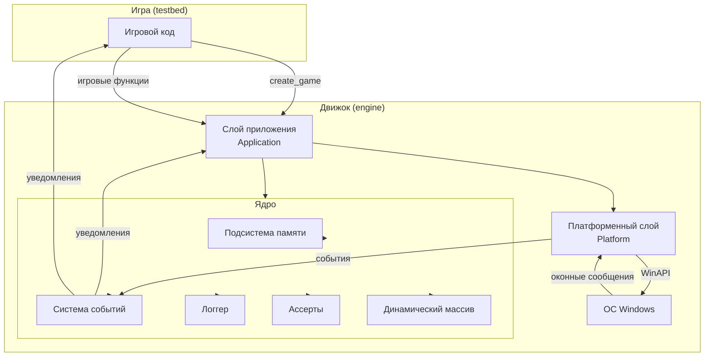

# Архитектура TestEngine

## Слои движка

```mermaid
graph TD
    subgraph "Игра (testbed)"
        Game[Игровой код]
    end

    subgraph "Движок (engine)"
        App[Слой приложения<br>Application]
        Core[Ядро]
        Platform[Платформенный слой<br>Platform]
        
        subgraph Core [Ядро]
            Memory[Подсистема памяти]
            Events[Система событий]
            Logger[Логгер]
            Asserts[Ассерты]
            DArray[Динамический массив]
        end
        
        App --> Core
        App --> Platform
        Core --> Memory
        Core --> Events
        Core --> Logger
        Core --> Asserts
        Core --> DArray
        Platform --> |WinAPI| WindowsOS[ОС Windows]
    end

    Game --> |create_game| App
    Game --> |игровые функции| App
    WindowsOS --> |оконные сообщения| Platform
    Platform --> |события| Events
    Events --> |уведомления| App
    Events --> |уведомления| Game
```