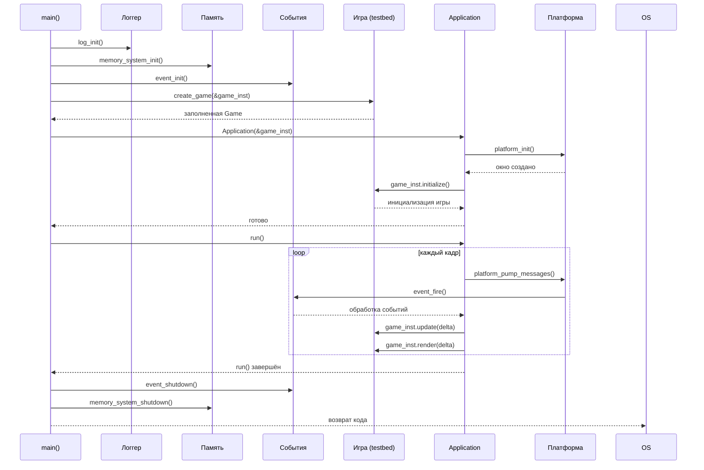

## Последовательность инициализации

```mermaid
sequenceDiagram
    participant Main as main()
    participant Logger as Логгер
    participant Memory as Память
    participant Events as События
    participant Game as Игра (testbed)
    participant App as Application
    participant Platform as Платформа

    Main->>Logger: log_init()
    Main->>Memory: memory_system_init()
    Main->>Events: event_init()
    Main->>Game: create_game(&game_inst)
    Game-->>Main: заполненная Game

    Main->>App: Application(&game_inst)
    App->>Platform: platform_init()
    Platform-->>App: окно создано
    App->>Game: game_inst.initialize()
    Game-->>App: инициализация игры
    App-->>Main: готово

    Main->>App: run()
    loop каждый кадр
        App->>Platform: platform_pump_messages()
        Platform->>Events: event_fire()
        Events-->>App: обработка событий
        App->>Game: game_inst.update(delta)
        App->>Game: game_inst.render(delta)
    end
    App-->>Main: run() завершён

    Main->>Events: event_shutdown()
    Main->>Memory: memory_system_shutdown()
    Main-->>OS: возврат кода
```